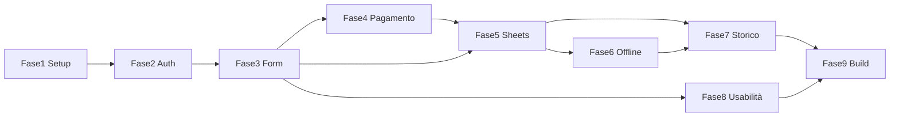

# Piano di Sviluppo — App Desktop Gestione Iscrizioni Evento Podistico

## Obiettivo

Client desktop multipiattaforma (macOS e Windows) per registrare le iscrizioni allo sportello dell’evento podistico, con registro centralizzato su Google Drive e supporto multi-postazione. Ogni operazione è tracciata per operatore.

---

## Stack Tecnologico

| Componente | Tecnologia |
|------------|------------|
| Framework | Electron con renderer React |
| Storage locale | SQLite via `better-sqlite3` (coda offline) |
| Cloud | Google Sheets API v4 (append atomico), OAuth2 |
| Build & distribuzione | `electron-builder` (.dmg macOS, .exe Windows) |

---

## Stato implementazione

| Fase | Descrizione | Stato |
|------|-------------|--------|
| 1 | Setup progetto (Electron + React, electron-builder, IPC) | ✅ Completata |
| 2 | Autenticazione operatore (login/logout, sessione) | ✅ Completata |
| 3 | Schermata principale e form iscrizione (campi, tariffario, calcolo real-time) | ✅ Completata |
| 4 | Gestione pagamento (contanti/digitale, resto, Consolida) | ✅ Completata |
| 5 | Integrazione Google Drive e consolidamento (OAuth2, append Sheets) | ✅ Completata |
| 6 | Coda offline e sincronizzazione (SQLite, retry) | ✅ Completata |
| 7 | Storico "Le mie transazioni" (filtro operatore/data, export PDF/CSV) | ✅ Completata |
| 8 | Usabilità e accessibilità (font, contrasto, tastiera) | ✅ Completata |
| 9 | Build e distribuzione (documentazione installer) | ✅ Completata |

---

## Fasi di Sviluppo

### Fase 1 — Setup progetto

- Inizializzare progetto Electron + React (es. con `electron-vite` o template ufficiale).
- Configurare `electron-builder`: target macOS (.dmg) e Windows (.exe con NSIS o Squirrel).
- Strutturare cartelle: `main/`, `renderer/`, `preload/`; impostare IPC sicuro tra main e renderer.
- Definire script npm: `dev`, `build`, `dist` per sviluppo e pacchetti di distribuzione.

**Deliverable:** App che si avvia in dev e genera installer per entrambe le piattaforme (anche vuoti).

---

### Fase 2 — Autenticazione operatore

- Schermata di login all’avvio: unico campo “Nominativo” (nome e cognome o codice operatore); nessuna password.
- Salvare in memoria (o contesto React) il nominativo della sessione; associarlo a ogni transazione.
- Logout: pulsante/menu che azzera la sessione e torna al login (o chiude l’app, secondo specifiche).
- Opzionale per questa fase: persistenza “ultimo operatore” in `localStorage` per precompilare il campo (solo UX).

**Deliverable:** Flusso avvio → login → schermata principale (placeholder) → logout.

---

### Fase 3 — Schermata principale e form iscrizione

- **Campi input:**
  - Numero totale partecipanti (numerico).
  - Di cui tesserati FIASP/UMV (numerico, ≤ totale).
  - Di cui con dono promozionale (numerico, ≤ totale).
- Validazione: tesserati ≤ totale, con dono ≤ totale; messaggi chiari in caso di errore.
- Calcolo automatico non tesserati = totale − tesserati (solo visualizzazione, non editabile).
- **Tariffario (costanti in app):**
  - Tesserati: senza dono € 2,50, con dono € 4,00.
  - Non tesserati: senza dono € 3,50, con dono € 5,00.
- **Calcolo in tempo reale:** ad ogni modifica aggiornare subtotali (tesserati senza/con dono, non tesserati senza/con dono) e totale dovuto. UI con font grandi e contrasto elevato (requisito usabilità).

**Deliverable:** Form completo con calcolo tariffario real-time e validazione campi.

---

### Fase 4 — Gestione pagamento

- Selettore modalità: **Contanti** | **Digitale (POS/bonifico/altro)**.
- **Contanti:** campo “Importo ricevuto”; calcolo e visualizzazione “Resto” (importo ricevuto − totale dovuto). Se importo ricevuto < totale dovuto: messaggio di errore e pulsante “Consolida” disabilitato.
- **Digitale:** nascondere/disabilitare importo ricevuto e resto; considerare pagamento saldato.
- Il pulsante “Consolida” è abilitato solo se: tutti i campi obbligatori validi e (in contanti) importo ricevuto ≥ totale dovuto.

**Deliverable:** Scelta pagamento, calcolo resto e validazione prima del consolidamento.

---

### Fase 5 — Integrazione Google Drive e consolidamento

- **OAuth2:** integrazione con Google (Sheets/Drive). Conservare token/refresh nel keychain di sistema (Keychain su macOS, Credential Manager su Windows), mai in file in chiaro.
- **Modello dati transazione:** timestamp, nominativo operatore, postazione (identificativo macchina/istanza), numero partecipanti totali, tesserati, con dono, totale importo, modalità pagamento, importo ricevuto (se contanti), resto (se contanti).
- **Scrittura:** usare Google Sheets API v4 con **append** (append row); evitare lettura-modifica-scrittura per gestire concorrenza tra postazioni.
- **Consolidamento:** al click “Consolida” costruire il record e inviarlo in append al foglio condiviso. In caso di successo: azzerare form e preparare nuova iscrizione.
- **Errori di rete/conflitto:** non bloccare l’operatore; salvare la transazione in coda locale (vedi Fase 6) e mostrare indicatore visivo (es. “In attesa di sincronizzazione”).

**Deliverable:** Consolidamento su Google Sheets con OAuth2 sicuro e append atomico.

---

### Fase 6 — Coda offline e sincronizzazione

- **SQLite (better-sqlite3):** tabella “pending_transactions” con gli stessi campi del record Sheets (o JSON serializzato). Inizializzare DB al primo avvio (path in user data).
- In caso di fallimento scrittura Sheets: inserire record nella coda SQLite e mostrare indicatore (es. badge “N in coda”).
- **Retry automatico:** in background (timer o dopo azione utente) tentare invio delle righe in coda con append; in caso di successo rimuovere dalla coda e aggiornare indicatore.
- Opzionale: rilevamento connettività (online/offline) per abilitare retry solo quando la connessione è disponibile.

**Deliverable:** Nessuna transazione persa; funzionamento degradato in assenza di rete con sync automatica al ritorno.

---

### Fase 7 — Storico “Le mie transazioni”

- Voce di menu “Le mie transazioni” che apre una vista (nuova finestra o route) con elenco filtrato: solo righe con nominativo = operatore in sessione.
- Dati da mostrare: data/ora, numero partecipanti, importo, modalità pagamento, stato sincronizzazione (se applicabile). Fonte: lettura dal foglio Google Sheets (range filtrato lato client) + eventuale merge con righe ancora in coda locale.
- Filtro per data (da–a).
- Esportazione vista filtrata: PDF e/o CSV (librerie JS per generazione file).

**Deliverable:** Vista storico per operatore con filtro data ed esportazione PDF/CSV.

---

### Fase 8 — Usabilità e accessibilità

- Font grandi, contrasto elevato in tutta l’UI (sportello).
- Navigazione da tastiera: Tab tra campi, Enter per invio/Consolida dove sensato.
- Obiettivo: completare un gruppo standard in meno di 30 secondi.

**Deliverable:** Checklist usabilità e tastiera verificata su schermata principale e storico.

---

### Fase 9 — Build e distribuzione

- Configurare `electron-builder`: prodotto .dmg (macOS) e .exe (NSIS o Squirrel) per Windows.
- Variabili d’ambiente o config per code signing (macOS/Windows) se richiesto.
- Documentare in README come eseguire `npm run build` / `npm run dist` e dove trovare gli installer.

**Deliverable:** Pacchetti .dmg e .exe generabili da CI o da sviluppatore con un comando.

---

## Requisiti non funzionali (checklist)

- [ ] Connettività: modalità degradata (coda locale) senza perdita transazioni.
- [ ] Usabilità: font grandi, contrasto, Tab + Enter, flusso &lt; 30 s.
- [ ] Multipiattaforma: .dmg (macOS) e .exe (Windows).
- [ ] Sicurezza: OAuth2 in keychain/credential manager, mai in chiaro.
- [ ] Tracciabilità: record immutabili; eventuali correzioni con riga di rettifica.

---

## Dipendenze tra fasi

Fasi 5 e 6 sono critiche per il comportamento “zero perdite”; le fasi 7–9 possono essere parallelizzate dopo la 5.
