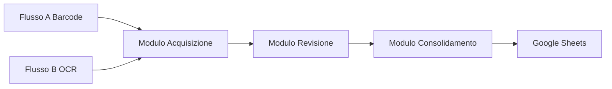
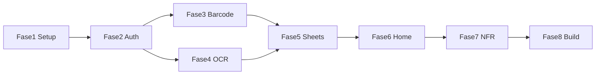

# Piano di Sviluppo — App Android Acquisizione Dati (Barcode + OCR)

## Obiettivo

Tool mobile Android per operatori che acquisiscono dati anagrafici tramite **barcode** (tessere) e **OCR su scrittura a mano**, con consolidamento su Google Sheets. Sviluppo senza Android Studio: stack consigliato **Flutter** (CLI + editor tipo VS Code).

---

## Architettura

Tre macro-moduli: acquisizione (barcode o OCR) → revisione operatore → consolidamento su GDrive. Il layer di scrittura su Google Sheets è condiviso.

---

## Stack Tecnologico

| Componente | Tecnologia |
|------------|------------|
| Framework | Flutter (Dart), target Android API 26+ |
| Camera / Barcode | `camera`, `mobile_scanner` o `barcode_scan2` |
| OCR | Google ML Kit (on-device) e/o Google Cloud Vision API (handwriting) |
| Cloud | Google Sheets API v4, OAuth 2.0 |
| Storage locale | SQLite (`sqflite`) per coda offline |
| Credenziali | `flutter_secure_storage` o equivalente |

---

## Fasi di Sviluppo

### Fase 1 — Setup progetto Flutter

- Creare progetto Flutter da CLI: `flutter create .` (nella cartella `mobile`).
- Configurare `android/app/build.gradle`: `minSdkVersion 26`.
- Aggiungere dipendenze: camera, scanner barcode, ML Kit / Google Vision (a seconda della scelta OCR), HTTP/OAuth per Sheets, `sqflite`, `flutter_secure_storage`.
- Strutturare cartelle: `lib/screens/`, `lib/services/`, `lib/models/`, `lib/widgets/`.
- Definire tema base e navigazione (es. MaterialApp con route named).

**Deliverable:** App Flutter che si avvia su emulatore/device Android con home placeholder e navigazione.

---

### Fase 2 — Autenticazione e configurazione

- **OAuth 2.0 Google:** flusso di login per autorizzare l’app a leggere/scrivere su Google Sheets. Salvare token/refresh in secure storage; rinnovo automatico.
- **Impostazioni (persistenti):**
  - URL/ID foglio Google Sheets di destinazione.
  - Identificativo operatore (nome o codice).
  - Opzionale: risoluzione fotocamera, flash, timeout scanner barcode, soglia confidenza OCR per evidenziare campi a bassa confidenza.
- Schermata Impostazioni raggiungibile dalla home; validazione URL foglio prima di salvare.

**Deliverable:** Operatore può effettuare login Google e configurare foglio + proprio identificativo; dati persistiti in modo sicuro.

---

### Fase 3 — Flusso A: Acquisizione Barcode (“Leggi Tessera”)

- **Schermata “Leggi Tessera”:** attivare fotocamera in modalità scanner continuo; supportare formati comuni (QR, Code128, Code39, EAN).
- **Rilevamento:** al riconoscimento del barcode: congelare frame, feedback sonoro e/o vibrazione, mostrare valore decodificato.
- **Classificazione:** schermata di conferma con codice letto e due pulsanti esclusivi: **FIASP** | **UMV**. Blocco su “Conferma” finché non è selezionata un’opzione.
- **Salvataggio:** al “Conferma” comporre record: timestamp, codice barcode, tipo tessera (FIASP/UMV), identificativo operatore, metodo inserimento (es. “barcode”). Inviare al modulo di consolidamento (Sheets o coda locale).
- **Errori:** se dopo N secondi nessun barcode leggibile, proporre inserimento manuale del codice (tastiera). Se la scrittura su Sheets fallisce: salvare in coda locale e ritentare in seguito (gestione in Fase 5).

**Deliverable:** Flusso completo Leggi Tessera → barcode → FIASP/UMV → conferma → invio a Sheets/coda.

---

### Fase 4 — Flusso B: Acquisizione OCR (“Leggi Anagrafica”)

- **Schermata “Leggi Anagrafica”:** fotocamera in modalità foto statica; guida visiva (riquadro/cornice) per inquadrare il testo.
- **Acquisizione:** operatore scatta foto; invio immagine a motore OCR (ML Kit on-device e/o Google Cloud Vision con handwriting, lingua italiano).
- **Parsing:** sul testo grezzo OCR identificare: **Nome**, **Cognome**, **Data di nascita** (formati GG/MM/AAAA, GG-MM-AAAA, eventuale testo esteso). Usare posizione righe o keyword (“nato il”, “cognome:”) per guidare il parser.
- **Revisione:** schermata con tre campi editabili precompilati; campi con confidenza sotto soglia evidenziati (es. bordo arancione). Operatore può correggere e poi confermare.
- **Salvataggio:** record con timestamp, operatore, nome, cognome, data di nascita, flag “OCR modificato” (booleano), metodo inserimento. Inviare al modulo consolidamento.
- **Errori:** se OCR non restituisce testo utile: messaggio + opzioni “Ritenta foto”, “Inserimento manuale”, “Annulla”.

**Deliverable:** Flusso Leggi Anagrafica → foto → OCR → parsing → revisione → conferma → invio a Sheets/coda.

---

### Fase 5 — Modulo consolidamento su Google Sheets

- **Struttura foglio:** due tab (fogli): **“Tessere”** e **“Anagrafiche”**; tab “Legenda” con descrizione colonne.
  - **Tessere:** Timestamp | Operatore | Codice Barcode | Tipo Tessera | Metodo inserimento.
  - **Anagrafiche:** Timestamp | Operatore | Nome | Cognome | Data di Nascita | OCR Modificato | Metodo inserimento.
- **Scrittura:** uso Google Sheets API v4 (append row) per append atomico; nessuna sovrascrittura per gestire concorrenza.
- **Offline:** in assenza di connessione (o in caso di errore) salvare record in SQLite (tabelle `pending_tessere`, `pending_anagrafiche` o unica tabella con tipo). Indicatore visivo: numero record in coda (es. “3 in attesa di sync”).
- **Sincronizzazione:** al ripristino connessione (e/o a intervalli / pulsante “Sincronizza”) inviare in ordine i record in coda; rimuovere dopo successo. Tutto il traffico su HTTPS/TLS.

**Deliverable:** Scrittura unificata su Sheets per entrambi i flussi; coda offline e sync automatica/manuale.

---

### Fase 6 — Home e navigazione

- **Home:** due pulsanti principali: “Leggi Tessera”, “Leggi Anagrafica”.
- Indicatore stato: connessione (online/offline) e sincronizzazione (es. “Tutto sincronizzato” / “N in coda”).
- Contatore record acquisiti nella sessione corrente (opzionale: anche totale giornaliero).
- Accesso a Impostazioni (icona o menu).

**Deliverable:** Home chiara con accesso ai due flussi, stato connessione/sync e contatore sessione.

---

### Fase 7 — Requisiti non funzionali e tuning

- **Target:** Android 8.0 (API 26)+.
- **Performance:** barcode riconosciuto in &lt; 2 secondi in condizioni normali; risposta OCR &lt; 5 secondi (ottimizzare risoluzione foto e uso on-device vs cloud).
- **Offline:** acquisizione sempre possibile; sync differita come in Fase 5.
- **Sicurezza:** dati in transito sempre su HTTPS; credenziali OAuth in secure storage.

**Deliverable:** App rispettosa di tempi e vincoli; checklist NFR verificata.

---

### Fase 8 — Test e distribuzione APK

- Test su device reale (fotocamera, barcode, OCR in condizioni reali).
- Build release: `flutter build apk` (o App Bundle per Play Store). Configurare signing per release.
- Documentare in README come generare APK e (se applicabile) come configurare Google Cloud / Sheets.

**Deliverable:** APK (o AAB) firmato e installabile; README aggiornato.

---

## Requisiti non funzionali (checklist)

- [ ] Android 8.0 (API 26) e successive.
- [ ] Barcode: riconoscimento &lt; 2 secondi in condizioni normali.
- [ ] OCR: risultato &lt; 5 secondi.
- [ ] Offline: acquisizione possibile; sincronizzazione differita senza perdita dati.
- [ ] Dati in transito: HTTPS/TLS verso Google Sheets.

---

## Dipendenze tra fasi

Fase 5 è il collo di bottiglia condiviso; Fasi 3 e 4 possono essere sviluppate in parallelo dopo Fase 2.
